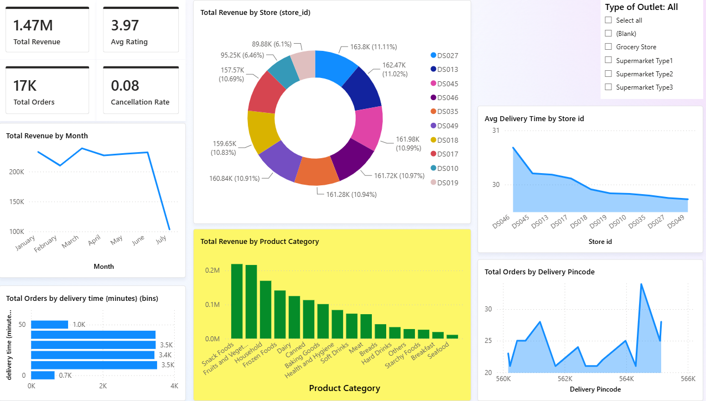

# BlinkIT Quick-Commerce Analytics Dashboard

## Problem Statement
Quick-commerce (Blinkit-style) operations depend on tight coordination between inventory, order fulfillment, and delivery logistics. This project simulates that environment end-to-end — from a relational database to a BI dashboard — to surface insights on revenue performance, delivery SLA, cancellations, and product demand across a network of dark stores.

## Data Source & Methodology
Since real Blinkit transaction data is proprietary, this project uses the public **Blinkit/BigMart Grocery Sales dataset** (Kaggle) as a realistic proxy for product and store attributes. That dataset provides real, aggregate Item × Outlet sales and rating figures across 10 stores and ~1,550 SKUs.

On top of that real base, a relational schema was engineered in MySQL:
- **Stores** and **Products** — extracted directly from the source data
- **Inventory** — stock levels, reorder thresholds, and expiry dates (synthesized, category-aware)
- **Customers** — a synthetic pool of 3,500 customers with pincode, distance-from-store, and delivery partner assignment
- **Orders** — each aggregate Item × Outlet record was exploded into 1–3 individual transactions with synthetic order IDs, timestamps, delivery times, statuses, and per-order ratings, with values proportionally split from the original aggregate sales figure

This keeps the product/store layer grounded in real data while making the order/customer/inventory layer transactional enough to analyze — the same way you'd design a schema before that data existed in production.

## Schema (ER Overview)
```
stores (store_id PK) ─┬──< inventory (store_id, sku_id) >──┬─ products (sku_id PK)
                       │                                     │
                       └──< orders (order_id PK) >───────────┘
                                    │
                             customers (customer_id PK)
```
*(See `sql/` for full DDL, load order, and foreign keys.)*

## Tools Used
- **MySQL** — relational schema design, data generation, referential integrity
- **Power BI** — data modeling, DAX measures, dashboard visualization
- **Python (pandas)** — initial data cleaning of the source dataset

## Dashboard


**KPIs:** ₹1.47M total revenue · 17K total orders · 3.97 avg rating · 8% cancellation rate

Pages/visuals include:
- Total Revenue by Store, Total Revenue by Month, Avg Delivery Time by Store
- Total Revenue by Product Category
- Total Orders by Delivery Time (bins), Total Orders by Delivery Pincode
- Outlet Type slicer for cross-filtering

## Key Insights
- **Revenue is evenly spread across the store network** — each of the 10 dark stores contributes roughly 10–11% of total revenue, with no single store dominating. This suggests balanced regional demand rather than concentration risk in one location.
- **Snack Foods and Fruits & Vegetables drive the most revenue** by a clear margin, while Seafood, Breakfast, and Starchy Foods trail well behind — a useful signal for prioritizing inventory and restocking effort by category.
- **Delivery SLA is fairly consistent across stores**, with average delivery time clustering around 29–31 minutes; only a couple of stores sit at the higher end, which is where operational attention would matter most.
- *(Note: the July dip in the monthly revenue trend reflects a partial month of data rather than an actual demand drop — worth calling out if presenting this dashboard.)*

## Repo Structure
```
├── data/
│   └── master_dataset.csv          # Cleaned source data
├── sql/
│   ├── BlinkIT_Project.sql         # Database + staging table + CSV import
│   ├── Stores.sql                  # Stores & Products dimension tables
│   ├── Products.sql                # Products table (standalone)
│   ├── Inventory.sql               # Inventory table
│   ├── Customer_Satisfaction.sql   # Customers table (synthetic pool)
│   ├── Sales_Order.sql             # Orders table (transaction generation)
│   └── Sanity_check.sql            # Post-load validation queries
├── powerbi/
│   └── blinkit_dashboard.pbix
├── screenshots/
│   └── Screenshot_dashboard.png
└── README.md
```

## How to Run
1. Run the SQL scripts in `sql/` in this order: `BlinkIT_Project.sql` → `Stores.sql` → `Products.sql` → `Inventory.sql` → `Customer_Satisfaction.sql` → `Sales_Order.sql` → `Sanity_check.sql` (to verify row counts and cancellation/low-stock figures)
2. Open `powerbi/blinkit_dashboard.pbix` in Power BI Desktop
3. Update the data source connection (File → Options and Settings → Data source settings) to point at your local MySQL instance
4. Refresh
